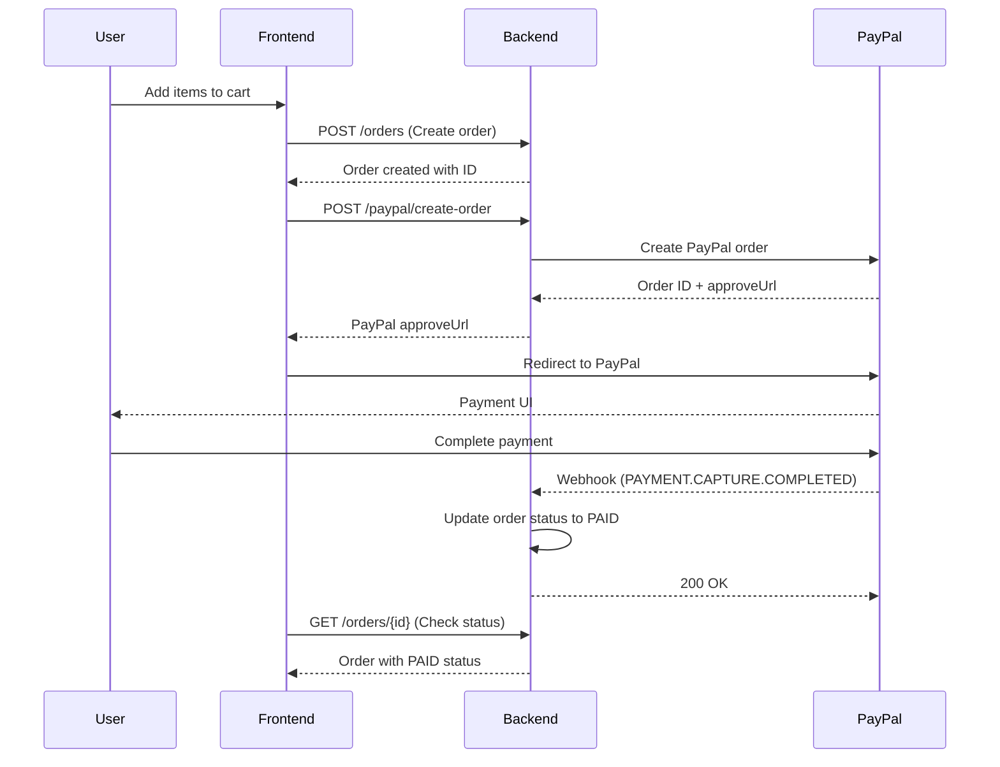

# 🛒 Frontend Integration Guide - PayPal Payment Flow

## 📋 Overview
This document provides comprehensive instructions for frontend developers to integrate with the PayPal payment system. The backend now supports complete order management and PayPal webhook processing.

---

## 🔄 Complete Payment Flow



---

## 🎯 Frontend Implementation Steps

### 1️⃣ Create Order First

**Endpoint:** `POST /orders`

**Request Body:**
```typescript
interface CreateOrderRequest {
  userId: string;
  items: OrderItem[];
  summary: OrderSummary;
  shippingAddressId?: string;
  billingAddressId?: string;
  notes?: string;
}

interface OrderItem {
  productId: number;
  productName: string;
  productSlug: string;
  variantId?: string;
  variantName?: string;
  quantity: number;
  unitPrice: number;
  totalPrice: number;
  sku?: string;
}

interface OrderSummary {
  subtotal: number;
  shipping: number;
  tax: number;
  discount: number;
  total: number;
  currency: string;
}
```

**Example:**
```javascript
const createOrder = async (orderData) => {
  const response = await fetch('/api/orders', {
    method: 'POST',
    headers: {
      'Content-Type': 'application/json',
      'Authorization': `Bearer ${token}`
    },
    body: JSON.stringify(orderData)
  });
  
  return await response.json();
};

// Usage
const order = await createOrder({
  userId: user.id,
  items: [
    {
      productId: 1,
      productName: "Premium T-Shirt",
      productSlug: "premium-t-shirt",
      variantId: "variant-123",
      variantName: "Red - Large",
      quantity: 2,
      unitPrice: 29.99,
      totalPrice: 59.98,
      sku: "TSH-001-RED-L"
    }
  ],
  summary: {
    subtotal: 59.98,
    shipping: 5.99,
    tax: 6.60,
    discount: 0,
    total: 72.57,
    currency: "USD"
  },
  shippingAddressId: address.id
});
```

### 2️⃣ Create PayPal Order

**Endpoint:** `POST /paypal/create-order`

**Request Body:**
```typescript
interface CreatePayPalOrderRequest {
  value: string;
  currency: string;
  description: string;
}
```

**Example:**
```javascript
const createPayPalOrder = async (orderId, orderTotal) => {
  const response = await fetch('/api/paypal/create-order', {
    method: 'POST',
    headers: {
      'Content-Type': 'application/json',
      'Authorization': `Bearer ${token}`
    },
    body: JSON.stringify({
      value: orderTotal.toString(),
      currency: 'USD',
      description: `Order #${orderId}`
    })
  });
  
  return await response.json();
};

// Usage
const paypalOrder = await createPayPalOrder(order.id, order.summary.total);
```

### 3️⃣ Handle PayPal Redirect

**Response from PayPal:**
```typescript
interface PayPalOrderResponse {
  success: boolean;
  orderId: string;
  approveUrl: string;
  status: string;
}
```

**Frontend Implementation:**
```javascript
const handlePayPalPayment = async (orderId) => {
  try {
    // 1. Create order
    const order = await createOrder(orderData);
    
    // 2. Create PayPal order
    const paypalOrder = await createPayPalOrder(order.id, order.summary.total);
    
    if (paypalOrder.success) {
      // 3. Store order ID for later reference
      localStorage.setItem('pendingOrderId', order.id);
      localStorage.setItem('paypalOrderId', paypalOrder.orderId);
      
      // 4. Redirect to PayPal
      window.location.href = paypalOrder.approveUrl;
    }
  } catch (error) {
    console.error('Payment initiation failed:', error);
  }
};
```

### 4️⃣ Handle PayPal Return

**Success Page Implementation:**
```javascript
// On your success/cancel page
const handlePayPalReturn = async () => {
  const pendingOrderId = localStorage.getItem('pendingOrderId');
  const paypalOrderId = localStorage.getItem('paypalOrderId');
  
  if (pendingOrderId) {
    try {
      // Check order status
      const order = await getOrderStatus(pendingOrderId);
      
      if (order.status === 'PAID') {
        // Payment successful
        showSuccessMessage('Payment completed successfully!');
        localStorage.removeItem('pendingOrderId');
        localStorage.removeItem('paypalOrderId');
      } else {
        // Payment pending or failed
        showPendingMessage('Payment is being processed...');
        
        // Poll for status updates
        pollOrderStatus(pendingOrderId);
      }
    } catch (error) {
      console.error('Error checking order status:', error);
    }
  }
};

const pollOrderStatus = async (orderId) => {
  const maxAttempts = 30; // 5 minutes with 10-second intervals
  let attempts = 0;
  
  const poll = async () => {
    try {
      const order = await getOrderStatus(orderId);
      
      if (order.status === 'PAID') {
        showSuccessMessage('Payment completed successfully!');
        localStorage.removeItem('pendingOrderId');
        localStorage.removeItem('paypalOrderId');
        return;
      }
      
      if (order.status === 'FAILED') {
        showErrorMessage('Payment failed. Please try again.');
        return;
      }
      
      attempts++;
      if (attempts < maxAttempts) {
        setTimeout(poll, 10000); // Poll every 10 seconds
      } else {
        showPendingMessage('Payment is taking longer than expected. Please contact support.');
      }
    } catch (error) {
      console.error('Error polling order status:', error);
    }
  };
  
  poll();
};
```

### 5️⃣ Get Order Status

**Endpoint:** `GET /orders/{id}`

**Example:**
```javascript
const getOrderStatus = async (orderId) => {
  const response = await fetch(`/api/orders/${orderId}`, {
    headers: {
      'Authorization': `Bearer ${token}`
    }
  });
  
  return await response.json();
};
```

---

## 📊 Order Status Values

| Status | Description | Frontend Action |
|--------|-------------|-----------------|
| `PENDING_PAYMENT` | Order created, payment not finished | Show "Payment Pending" and PayPal CTA |
| `PAID` | Payment completed successfully | Show success message, redirect to order details |
| `PROCESSING` | Payment received, order being prepared internally | Show "Processing" badge |
| `PACKED` | Warehouse packed the parcel | Show "Packed" with warehouse note |
| `READY_TO_GO` | Waiting for carrier pickup | Show "Ready to hand off" |
| `AT_CARRIER_FACILITY` | Arrived at first carrier hub | Show carrier info + hub indicator |
| `IN_TRANSIT` | Moving between carrier hubs/countries | Show progress timeline |
| `ARRIVED_IN_COUNTRY` | Arrived in destination country | Highlight customs/clearance stage |
| `AT_LOCAL_FACILITY` | At last-mile depot | Show "Local facility" status |
| `OUT_FOR_DELIVERY` | Courier is delivering | Show dynamic "Out for delivery" banner |
| `DELIVERED` | Order delivered | Show completion message |
| `CANCELLED` | Order cancelled | Show cancellation message |
| `FAILED` | Payment failed | Show error, allow retry |
| `REFUNDED` | Payment refunded | Show refund information |

---

## 🎨 UI/UX Recommendations

### Payment Button
```jsx
const PayPalPaymentButton = ({ orderData, onSuccess, onError }) => {
  const [loading, setLoading] = useState(false);
  
  const handlePayment = async () => {
    setLoading(true);
    try {
      await handlePayPalPayment(orderData);
    } catch (error) {
      onError(error);
    } finally {
      setLoading(false);
    }
  };
  
  return (
    <button 
      onClick={handlePayment}
      disabled={loading}
      className="paypal-button"
    >
      {loading ? 'Processing...' : 'Pay with PayPal'}
    </button>
  );
};
```

### Order Status Component
```jsx
const OrderStatus = ({ order }) => {
  const getStatusColor = (status) => {
    const colors = {
      PENDING_PAYMENT: 'orange',
      PAID: 'blue',
      PROCESSING: 'purple',
      PACKED: 'teal',
      READY_TO_GO: 'indigo',
      AT_CARRIER_FACILITY: 'cyan',
      IN_TRANSIT: 'royalblue',
      ARRIVED_IN_COUNTRY: 'limegreen',
      AT_LOCAL_FACILITY: 'lightgreen',
      OUT_FOR_DELIVERY: 'darkorange',
      DELIVERED: 'green',
      CANCELLED: 'red',
      FAILED: 'red',
      REFUNDED: 'gray'
    };
    return colors[status] || 'gray';
  };
  
  return (
    <div className={`order-status status-${getStatusColor(order.status)}`}>
      <span className="status-text">{order.status}</span>
      {order.paidAt && (
        <span className="paid-date">
          Paid on {new Date(order.paidAt).toLocaleDateString()}
        </span>
      )}
    </div>
  );
};
```

---

## 🔧 Error Handling

### Common Error Scenarios

1. **Network Errors**
```javascript
const handlePaymentWithRetry = async (orderData, maxRetries = 3) => {
  for (let i = 0; i < maxRetries; i++) {
    try {
      return await handlePayPalPayment(orderData);
    } catch (error) {
      if (i === maxRetries - 1) throw error;
      await new Promise(resolve => setTimeout(resolve, 1000 * (i + 1)));
    }
  }
};
```

2. **Payment Failures**
```javascript
const handlePaymentFailure = (error) => {
  if (error.status === 'FAILED') {
    showErrorMessage('Payment failed. Please check your payment method and try again.');
  } else if (error.status === 'CANCELLED') {
    showInfoMessage('Payment was cancelled. You can try again anytime.');
  }
};
```

---

## 📱 Mobile Considerations

### Responsive Design
- Ensure PayPal buttons are touch-friendly (minimum 44px height)
- Use appropriate button sizes for mobile screens
- Test PayPal redirect flow on mobile browsers

### Progressive Web App (PWA)
- Handle PayPal redirects in PWA context
- Store order state in localStorage/sessionStorage
- Implement proper back button handling

---

## 🧪 Testing

### Test Scenarios
1. **Successful Payment Flow**
   - Create order → PayPal redirect → Complete payment → Verify status

2. **Payment Cancellation**
   - Start payment → Cancel on PayPal → Verify order remains PENDING

3. **Payment Failure**
   - Simulate failed payment → Verify order status updates to FAILED

4. **Network Interruption**
   - Test payment flow with poor network conditions

### PayPal Sandbox Testing
- Use PayPal sandbox accounts for testing
- Test with different payment methods (cards, PayPal balance)
- Verify webhook processing in sandbox environment

---

## 📞 Support & Troubleshooting

### Common Issues

1. **Order Status Not Updating**
   - Check webhook endpoint is accessible
   - Verify PayPal webhook configuration
   - Check server logs for webhook processing errors

2. **Payment Redirect Issues**
   - Ensure PayPal URLs are HTTPS
   - Check CORS configuration
   - Verify PayPal app credentials

3. **Order Creation Failures**
   - Validate order data structure
   - Check user authentication
   - Verify address references exist

### Debug Tools
- Use browser developer tools to monitor network requests
- Check PayPal Developer Dashboard for webhook logs
- Monitor backend logs for payment processing events

---

**Author:** Backend Team — *Ecom_Project / PayPal Integration*  
**Last Updated:** January 2025
