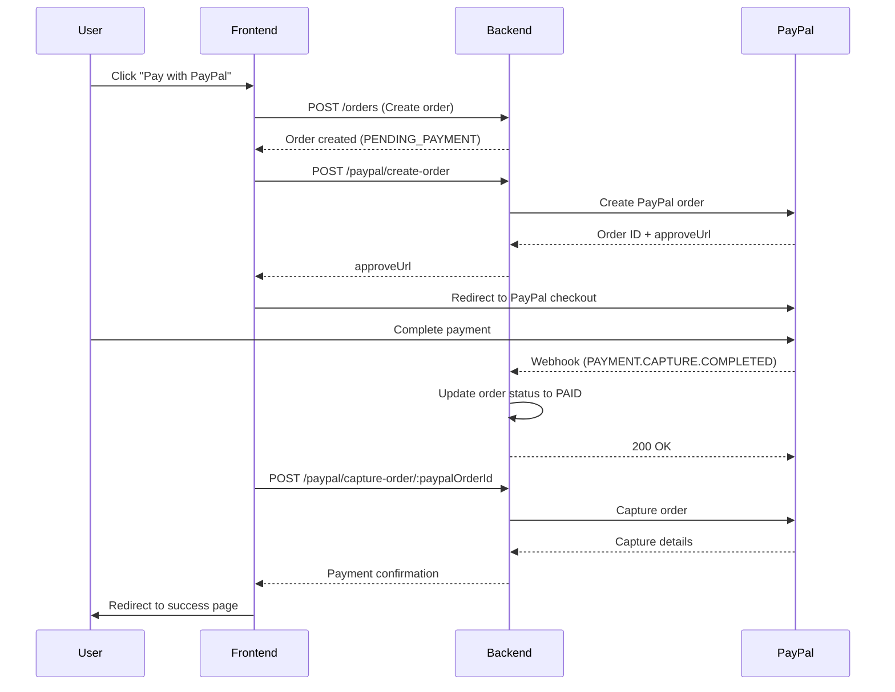

# 📦 Orders Backend - Tài liệu Hệ thống Quản lý Đơn hàng

> **Phiên bản:** 1.0  
> **Ngày cập nhật:** 16/12/2025  
> **Module:** `src/modules/orders`

---

## 📋 Mục lục

1. [Tổng quan hệ thống](#1-tổng-quan-hệ-thống)
2. [Cấu trúc dữ liệu](#2-cấu-trúc-dữ-liệu)
3. [API Endpoints](#3-api-endpoints)
4. [Vòng đời đơn hàng & Status Flow](#4-vòng-đời-đơn-hàng--status-flow)
5. [Tích hợp PayPal](#5-tích-hợp-paypal)
6. [Business Logic & Validation](#6-business-logic--validation)
7. [Error Handling](#7-error-handling)
8. [Best Practices](#8-best-practices)

---

## 1. Tổng quan hệ thống

### 1.1. Kiến trúc module

```
src/modules/orders/
├── orders.controller.ts      # REST API endpoints
├── orders.service.ts          # Business logic
├── orders.module.ts           # Module configuration
├── entities/
│   └── order.entity.ts        # Database entity
├── dto/
│   └── order.dto.ts           # Data transfer objects
├── enums/
│   └── order-status.enum.ts   # Order status constants
└── docs/
    ├── capture-change-status-tracking.md
    └── capture-order-response-update.md
```

### 1.2. Dependencies

```typescript
// Module imports
TypeOrmModule.forFeature([Order, User, Address, Product])
MailModule          // Gửi email xác nhận
AddressesModule     // Quản lý địa chỉ giao hàng
```

### 1.3. Database Relations

```
Order
  ├── ManyToOne → User (userId)
  ├── ManyToOne → Address (shippingAddressId)
  ├── ManyToOne → Address (billingAddressId)
  └── JSONB → items[] (OrderItem[])
```

---

## 2. Cấu trúc dữ liệu

### 2.1. Order Entity

**File:** `entities/order.entity.ts`

```typescript
@Entity('orders')
export class Order {
  @PrimaryGeneratedColumn('uuid')
  id: string;                    // UUID primary key

  @Column('uuid')
  userId: string;                // Foreign key to User

  @Column({ length: 50, unique: true })
  orderNumber: string;           // Format: ORD-YYYYMMDD-XXXX

  @Column({ length: 30, default: OrderStatus.PENDING_PAYMENT })
  status: OrderStatus;           // Current order status

  @Column({ type: 'jsonb', default: [] })
  tracking_history: TrackingHistoryItem[];  // Status change history

  // Payment information
  @Column({ length: 20, nullable: true })
  paymentMethod: 'PAYPAL' | 'STRIPE' | 'COD';

  @Column({ length: 100, nullable: true })
  paypalOrderId: string;         // PayPal order ID

  @Column({ length: 100, nullable: true })
  paypalTransactionId: string;   // PayPal transaction/capture ID

  @Column({ type: 'decimal', precision: 10, scale: 2, nullable: true })
  paidAmount: string;            // Amount paid (stored as string)

  @Column({ length: 3, nullable: true })
  paidCurrency: string;          // e.g., "USD", "VND"

  @Column({ type: 'timestamp', nullable: true })
  paidAt: Date;                  // Payment timestamp

  // Order items & pricing
  @Column({ type: 'jsonb' })
  items: OrderItem[];            // Array of order items

  @Column({ type: 'jsonb' })
  summary: OrderSummary;         // Pricing summary

  // Shipping information
  @Column('uuid', { nullable: true })
  shippingAddressId: string;

  @Column('uuid', { nullable: true })
  billingAddressId: string;

  @Column({ type: 'text', nullable: true })
  notes: string;                 // Customer notes

  @Column({ type: 'text', nullable: true })
  internalNotes: string;         // Admin notes (internal only)

  // Shipping tracking
  @Column({ length: 100, nullable: true })
  trackingNumber: string;

  @Column({ length: 100, nullable: true })
  carrier: string;               // e.g., "UPS", "DHL", "Vietnam Post"

  @Column({ type: 'timestamp', nullable: true })
  shippedAt: Date;

  @Column({ type: 'timestamp', nullable: true })
  deliveredAt: Date;

  // Timestamps
  @CreateDateColumn()
  createdAt: Date;

  @UpdateDateColumn()
  updatedAt: Date;
}
```

### 2.2. OrderItem Interface

```typescript
interface OrderItem {
  productId: string;              // Product UUID
  productName: string;
  productSlug: string;
  variantId?: string;             // Optional variant ID
  variantName?: string;           // e.g., "Red - Large"
  quantity: number;
  unitPrice: string;              // Format: "29.99"
  totalPrice: string;             // Format: "59.98"
  sku?: string;
  productThumbnailUrl?: string;   // Added dynamically when fetching
}
```

### 2.3. OrderSummary Interface

```typescript
interface OrderSummary {
  subtotal: string;    // Format: "59.98"
  shipping: string;    // Format: "5.99"
  tax: string;         // Format: "6.60"
  discount: string;    // Format: "0.00"
  total: string;       // Format: "72.57"
  currency: string;    // e.g., "USD"
}
```

### 2.4. TrackingHistoryItem Interface

```typescript
interface TrackingHistoryItem {
  from_status: OrderStatus;   // Status trước đó
  to_status: OrderStatus;     // Status mới
  changed_at: Date;           // Thời điểm thay đổi
  changed_by: string;         // userId hoặc "SYSTEM" / "CRON"
  note?: string | null;       // Ghi chú tùy chọn
}
```

### 2.5. Order Status Enum

**File:** `enums/order-status.enum.ts`

```typescript
export enum OrderStatus {
  PENDING_PAYMENT = 'PENDING_PAYMENT',        // Chờ thanh toán
  PAID = 'PAID',                              // Đã thanh toán
  PROCESSING = 'PROCESSING',                  // Đang xử lý
  PACKED = 'PACKED',                          // Đã đóng gói
  READY_TO_GO = 'READY_TO_GO',               // Sẵn sàng giao
  AT_CARRIER_FACILITY = 'AT_CARRIER_FACILITY', // Tại kho vận chuyển
  IN_TRANSIT = 'IN_TRANSIT',                  // Đang vận chuyển
  ARRIVED_IN_COUNTRY = 'ARRIVED_IN_COUNTRY',  // Đã về nước
  AT_LOCAL_FACILITY = 'AT_LOCAL_FACILITY',    // Tại kho nội địa
  OUT_FOR_DELIVERY = 'OUT_FOR_DELIVERY',      // Đang giao hàng
  DELIVERED = 'DELIVERED',                    // Đã giao hàng
  CANCELLED = 'CANCELLED',                    // Đã hủy
  FAILED = 'FAILED',                          // Thất bại
  REFUNDED = 'REFUNDED',                      // Đã hoàn tiền
}
```

---

## 3. API Endpoints

### 3.1. Tạo đơn hàng

**Endpoint:** `POST /orders`

**Authentication:** JWT Required

**Request Body:**

```typescript
{
  "userId": "uuid-string",
  "items": [
    {
      "productId": "fc734035-40fe-441c-a989-92004dc368fb",
      "productName": "Premium T-Shirt",
      "productSlug": "premium-t-shirt",
      "variantId": "variant-123",
      "variantName": "Red - Large",
      "quantity": 2,
      "unitPrice": "29.99",
      "totalPrice": "59.98",
      "sku": "TSH-001-RED-L"
    }
  ],
  "summary": {
    "subtotal": "59.98",
    "shipping": "5.99",
    "tax": "6.60",
    "discount": "0.00",
    "total": "72.57",
    "currency": "USD"
  },
  "paymentMethod": "PAYPAL",
  "shippingAddressId": "address-uuid",  // Option 1: Existing address
  "billingAddressId": "address-uuid",
  "notes": "Please deliver after 5 PM",
  
  // Option 2: Inline shipping address (will be saved to user's addresses)
  "shipping_address": {
    "full_name": "John Doe",
    "phone": "+84 912345678",
    "countryCode": "VN",
    "province": "Ho Chi Minh",
    "district": "District 1",
    "ward": "Ward 1",
    "address_line": "123 Main St",
    "address_line2": "Apt 12B",
    "city": "Ho Chi Minh City",
    "postalCode": "700000",
    "label": "Home",
    "note": "Call before arrival"
  }
}
```

**Response:**

```json
{
  "id": "order-uuid",
  "orderNumber": "ORD-20251216-1234",
  "userId": "user-uuid",
  "status": "PENDING_PAYMENT",
  "paymentMethod": "PAYPAL",
  "items": [...],
  "summary": {...},
  "createdAt": "2025-12-16T10:00:00Z",
  "updatedAt": "2025-12-16T10:00:00Z"
}
```

**Validation Rules:**

- `userId` phải tồn tại trong database
- `items` array không được rỗng
- Mỗi item phải có `productId` (UUID), `productName`, `quantity > 0`, `unitPrice`, `totalPrice`
- Price format: phải là string với 2 chữ số thập phân (e.g., "29.99")
- `summary` phải có đầy đủ các field: `subtotal`, `shipping`, `tax`, `discount`, `total`, `currency`
- Phải cung cấp `shippingAddressId` HOẶC `shipping_address`, không được cả hai
- Nếu dùng `shipping_address`, địa chỉ sẽ được tự động lưu vào user's addresses

---

### 3.2. Lấy danh sách đơn hàng

**Endpoint:** `GET /orders`

**Authentication:** JWT Required

**Query Parameters:**

- `userId` (optional, Admin only): Filter by user ID
- `status` (optional): Filter by order status

**Authorization Logic:**

- **User role:** Chỉ xem được đơn hàng của chính mình
- **Admin role:** Xem được tất cả đơn hàng, hoặc filter theo userId

**Response:**

```json
[
  {
    "id": "order-uuid",
    "orderNumber": "ORD-20251216-1234",
    "status": "PAID",
    "paymentMethod": "PAYPAL",
    "paypalOrderId": "6S5011234B5562345",
    "paypalTransactionId": "3GG57250SL7328348",
    "paidAmount": "72.57",
    "paidCurrency": "USD",
    "paidAt": "2025-12-16T10:05:00Z",
    "user": {...},
    "items": [...],
    "summary": {...},
    "createdAt": "2025-12-16T10:00:00Z"
  }
]
```

---

### 3.3. Lấy đơn hàng của user hiện tại

**Endpoint:** `GET /orders/my-orders`

**Authentication:** JWT Required

**Response:** Giống như `GET /orders` nhưng chỉ trả về orders của user đang đăng nhập

**Note:** Endpoint này tự động populate `productThumbnailUrl` cho mỗi order item

---

### 3.4. Lấy đơn hàng theo ID

**Endpoint:** `GET /orders/:id`

**Authentication:** JWT Required

**Response:**

```json
{
  "id": "order-uuid",
  "orderNumber": "ORD-20251216-1234",
  "status": "PAID",
  "paymentMethod": "PAYPAL",
  "paypalOrderId": "6S5011234B5562345",
  "paypalTransactionId": "3GG57250SL7328348",
  "paidAmount": "72.57",
  "paidCurrency": "USD",
  "paidAt": "2025-12-16T10:05:00Z",
  "items": [
    {
      "productId": "fc734035-40fe-441c-a989-92004dc368fb",
      "productName": "Premium T-Shirt",
      "productSlug": "premium-t-shirt",
      "variantId": "variant-123",
      "variantName": "Red - Large",
      "quantity": 2,
      "unitPrice": "29.99",
      "totalPrice": "59.98",
      "sku": "TSH-001-RED-L",
      "productThumbnailUrl": "https://cloudinary.com/image.jpg"
    }
  ],
  "summary": {...},
  "shippingAddress": {...},
  "billingAddress": {...},
  "createdAt": "2025-12-16T10:00:00Z"
}
```

**Note:** Tự động fetch product thumbnails từ `products.images[0]`

---

### 3.5. Lấy đơn hàng theo Order Number

**Endpoint:** `GET /orders/number/:orderNumber`

**Authentication:** JWT Required

**Example:** `GET /orders/number/ORD-20251216-1234`

**Response:** Giống như `GET /orders/:id`

---

### 3.6. Cập nhật đơn hàng (Admin Only)

**Endpoint:** `PATCH /orders/:id`

**Authentication:** JWT Required + Admin Role

**Request Body:**

```typescript
{
  "status": "PROCESSING",              // Optional
  "paymentMethod": "PAYPAL",           // Optional
  "paypalOrderId": "6S5011234B5562345", // Optional
  "paypalTransactionId": "3GG57250SL7328348", // Optional
  "paidAmount": "72.57",               // Optional
  "paidCurrency": "USD",               // Optional
  "trackingNumber": "1Z999AA1234567890", // Optional
  "carrier": "UPS",                    // Optional
  "internalNotes": "Customer requested expedited shipping" // Optional
}
```

**Validation:**

- Status transition phải hợp lệ (xem [Section 4.2](#42-status-transition-rules))
- Payment method phải là: `PAYPAL`, `STRIPE`, hoặc `COD`

**Response:** Trả về order đã cập nhật

---

### 3.7. Thay đổi status với tracking history (Admin Only)

**Endpoint:** `POST /orders/:id/status`

**Authentication:** JWT Required + Admin Role

**Request Body:**

```json
{
  "toStatus": "PACKED",
  "note": "Order packed at warehouse"
}
```

**Response:**

```json
{
  "id": "order-uuid",
  "orderNumber": "ORD-20251216-1234",
  "status": "PACKED",
  "tracking_history": [
    {
      "from_status": "PROCESSING",
      "to_status": "PACKED",
      "changed_at": "2025-12-16T11:00:00.000Z",
      "changed_by": "admin-user-uuid",
      "note": "Order packed at warehouse"
    }
  ]
}
```

**Logic:**

1. Validate status transition (phải hợp lệ theo flow)
2. Append record vào `tracking_history` array
3. Update `order.status` sang status mới
4. Log action
5. `changed_by` được lấy ưu tiên từ `req.user.id`, fallback `req.user.sub`/`req.user.userId`, cuối cùng là `"SYSTEM"`

---

### 3.8. Xem lịch sử thay đổi status

**Endpoint:** `GET /orders/:id/status-history`

**Authentication:** JWT Required

**Response:**

```json
[
  {
    "from_status": "PAID",
    "to_status": "PROCESSING",
    "changed_at": "2025-12-16T01:00:00Z",
    "changed_by": "admin-uuid",
    "note": null,
    "duration_seconds": 3600
  },
  {
    "from_status": "PROCESSING",
    "to_status": "PACKED",
    "changed_at": "2025-12-16T02:00:00Z",
    "changed_by": "admin-uuid",
    "note": "Order packed at warehouse",
    "duration_seconds": 7200
  },
  {
    "from_status": "PACKED",
    "to_status": "READY_TO_GO",
    "changed_at": "2025-12-16T04:00:00Z",
    "changed_by": "SYSTEM",
    "note": null,
    "duration_seconds": undefined
  }
]
```

**Note:** `duration_seconds` được tính tự động dựa trên khoảng thời gian giữa các status change

---

### 3.9. Xóa đơn hàng (Admin Only)

**Endpoint:** `DELETE /orders/:id`

**Authentication:** JWT Required + Admin Role

**Response:**

```json
{
  "message": "Order deleted successfully"
}
```

---

## 4. Vòng đời đơn hàng & Status Flow

### 4.1. Lifecycle Diagram

```
┌─────────────────┐
│ PENDING_PAYMENT │ ← Order được tạo
└────────┬────────┘
         │ (User completes payment)
         ↓
    ┌────────┐
    │  PAID  │ ← PayPal webhook updates
    └───┬────┘
        │ (Admin starts processing)
        ↓
  ┌──────────────┐
  │  PROCESSING  │ ← Preparing items
  └──────┬───────┘
         │ (Admin packs order)
         ↓
    ┌────────┐
    │ PACKED │
    └───┬────┘
        │
        ↓
 ┌──────────────┐
 │ READY_TO_GO  │ ← Ready for carrier pickup
 └──────┬───────┘
        │
        ↓
┌──────────────────────┐
│ AT_CARRIER_FACILITY  │ ← Carrier received
└──────────┬───────────┘
           │
           ↓
    ┌─────────────┐
    │  IN_TRANSIT │ ← Shipping internationally
    └──────┬──────┘
           │
           ↓
 ┌────────────────────┐
 │ ARRIVED_IN_COUNTRY │ ← Cleared customs
 └─────────┬──────────┘
           │
           ↓
 ┌────────────────────┐
 │ AT_LOCAL_FACILITY  │ ← Local distribution center
 └─────────┬──────────┘
           │
           ↓
 ┌────────────────────┐
 │ OUT_FOR_DELIVERY   │ ← Out for final delivery
 └─────────┬──────────┘
           │
           ↓
    ┌─────────────┐
    │  DELIVERED  │ ← Final status (success)
    └─────────────┘
```

### 4.2. Status Transition Rules

**Implementation:** `OrdersService.ORDER_STATUS_FLOW`

```typescript
private readonly ORDER_STATUS_FLOW: Record<OrderStatus, OrderStatus[]> = {
  [OrderStatus.PENDING_PAYMENT]: [
    OrderStatus.PAID,
    OrderStatus.CANCELLED
  ],
  
  [OrderStatus.PAID]: [
    OrderStatus.PROCESSING,
    OrderStatus.REFUNDED
  ],
  
  [OrderStatus.PROCESSING]: [
    OrderStatus.PACKED,
    OrderStatus.CANCELLED
  ],
  
  [OrderStatus.PACKED]: [
    OrderStatus.READY_TO_GO
  ],
  
  [OrderStatus.READY_TO_GO]: [
    OrderStatus.AT_CARRIER_FACILITY
  ],
  
  [OrderStatus.AT_CARRIER_FACILITY]: [
    OrderStatus.IN_TRANSIT
  ],
  
  [OrderStatus.IN_TRANSIT]: [
    OrderStatus.ARRIVED_IN_COUNTRY
  ],
  
  [OrderStatus.ARRIVED_IN_COUNTRY]: [
    OrderStatus.AT_LOCAL_FACILITY
  ],
  
  [OrderStatus.AT_LOCAL_FACILITY]: [
    OrderStatus.OUT_FOR_DELIVERY
  ],
  
  [OrderStatus.OUT_FOR_DELIVERY]: [
    OrderStatus.DELIVERED,
    OrderStatus.FAILED
  ],
  
  [OrderStatus.DELIVERED]: [],  // Terminal state
  
  [OrderStatus.FAILED]: [
    OrderStatus.PROCESSING,
    OrderStatus.REFUNDED
  ],
  
  [OrderStatus.CANCELLED]: [
    OrderStatus.REFUNDED
  ],
  
  [OrderStatus.REFUNDED]: []  // Terminal state
};
```

**Validation Logic:**

```typescript
private isValidStatusTransition(currentStatus: OrderStatus, newStatus: OrderStatus): boolean {
  // Không cho phép transition sang chính status hiện tại
  if (currentStatus === newStatus) {
    return false;
  }
  
  // Check theo flow map
  return this.ORDER_STATUS_FLOW[currentStatus]?.includes(newStatus) ?? false;
}
```

**Error Example:**

Nếu cố gắng chuyển từ `PAID` → `DELIVERED` (không hợp lệ):

```json
{
  "statusCode": 400,
  "message": "Invalid status transition from \"PAID\" to \"DELIVERED\". Valid transitions from \"PAID\" are: PROCESSING, REFUNDED.",
  "error": "Bad Request"
}
```

---

## 5. Tích hợp PayPal

### 5.1. Payment Flow Overview



### 5.2. Create PayPal Order

**Endpoint:** `POST /paypal/create-order`

**Request:**

```json
{
  "order_id": "order-uuid",
  "value": "72.57",
  "currency": "USD",
  "description": "Order #ORD-20251216-1234"
}
```

**Response:**

```json
{
  "success": true,
  "orderId": "6S5011234B5562345",
  "approveUrl": "https://www.sandbox.paypal.com/checkoutnow?token=6S5011234B5562345",
  "status": "CREATED"
}
```

**Frontend Implementation:**

```javascript
// 1. Create order
const order = await createOrder(orderData);

// 2. Create PayPal order
const paypalOrder = await createPayPalOrder({
  order_id: order.id,
  value: order.summary.total,
  currency: order.summary.currency,
  description: `Order #${order.orderNumber}`
});

// 3. Redirect to PayPal
if (paypalOrder.success) {
  window.location.href = paypalOrder.approveUrl;
}
```

---

### 5.3. Capture PayPal Order

**Endpoint:** `POST /paypal/capture-order/:paypalOrderId`

**Request Body (Optional):**

```json
{
  "paypalOrderId": "6S5011234B5562345",
  "orderId": "order-uuid"
}
```

**Response:**

```json
{
  "success": true,
  "status": "COMPLETED",
  "orderId": "order-uuid",
  "orderNumber": "ORD-20251216-1234",
  "paypalOrderId": "6S5011234B5562345",
  "paypalTransactionId": "3GG57250SL7328348",
  "paidAmount": "72.57",
  "currency": "USD",
  "paidAt": "2025-12-16T10:05:00Z",
  "payer": {
    "email": "buyer@example.com",
    "name": {
      "given_name": "John",
      "surname": "Doe"
    }
  }
}
```

**Frontend Implementation:**

```javascript
// After PayPal redirect back
const urlParams = new URLSearchParams(window.location.search);
const paypalOrderId = urlParams.get('token');

const captureResponse = await fetch(`/api/paypal/capture-order/${paypalOrderId}`, {
  method: 'POST',
  headers: {
    'Authorization': `Bearer ${token}`,
    'Content-Type': 'application/json'
  }
});

if (captureResponse.success) {
  // Redirect to success page
  window.location.href = `/checkout/success?orderId=${captureResponse.orderId}`;
}
```

---

### 5.4. PayPal Webhook Processing

**Endpoint:** `POST /paypal/webhook` (Internal)

**Handled Events:**

1. **PAYMENT.CAPTURE.COMPLETED** → Update order to `PAID`
2. **PAYMENT.CAPTURE.DENIED** → Update order to `FAILED`
3. **PAYMENT.CAPTURE.REFUNDED** → Update order to `REFUNDED`

**Processing Logic (`PaymentService.handleCaptureCompleted`):**

```typescript
async handleCaptureCompleted(resource: any): Promise<void> {
  const orderId = resource?.supplementary_data?.related_ids?.order_id;
  const transactionId = resource?.id;
  const amount = parseFloat(resource?.amount?.value);
  const currency = resource?.amount?.currency_code;

  // 1. Check idempotency (prevent duplicate processing)
  const existingEvent = await this.paypalEventRepository.findOne({
    where: { eventId: resource.id }
  });
  if (existingEvent) {
    return; // Already processed
  }

  // 2. Create event record
  await this.paypalEventRepository.save({
    eventId: resource.id,
    orderId,
    type: 'PAYMENT.CAPTURE.COMPLETED',
    amount,
    currency,
    status: resource.status,
    rawData: resource
  });

  // 3. Update order status
  await this.orderRepository.update(
    { paypalOrderId: orderId },
    {
      status: OrderStatus.PAID,
      paypalTransactionId: transactionId,
      paidAmount: amount.toFixed(2),
      paidCurrency: currency,
      paidAt: new Date()
    }
  );

  // 4. Send confirmation email
  const order = await this.orderRepository.findOne({
    where: { paypalOrderId: orderId },
    relations: ['user', 'shippingAddress']
  });
  
  if (order) {
    await this.sendPaymentSuccessEmail(order, amount, currency, transactionId);
  }

  // 5. Additional business logic
  await this.processOrderAfterPayment(order);
}
```

---

## 6. Business Logic & Validation

### 6.1. Order Number Generation

**Format:** `ORD-YYYYMMDD-XXXX`

**Implementation:**

```typescript
private generateOrderNumber(): string {
  const now = new Date();
  const year = now.getFullYear();
  const month = String(now.getMonth() + 1).padStart(2, '0');
  const day = String(now.getDate()).padStart(2, '0');
  const random = Math.floor(Math.random() * 10000).toString().padStart(4, '0');
  
  return `ORD-${year}${month}${day}-${random}`;
}
```

**Example:** `ORD-20251216-4829`

---

### 6.2. Address Handling

**Two Options:**

1. **Option 1:** Use existing address ID

```json
{
  "shippingAddressId": "address-uuid",
  "billingAddressId": "address-uuid"
}
```

2. **Option 2:** Provide inline address (auto-saved)

```json
{
  "shipping_address": {
    "full_name": "John Doe",
    "phone": "+84 912345678",
    "countryCode": "VN",
    "province": "Ho Chi Minh",
    "district": "District 1",
    "address_line": "123 Main St"
  }
}
```

**Logic:**

- Nếu dùng `shipping_address`, backend sẽ tự động:
  1. Map sang `UpdateAddressDto`
  2. Call `addressesService.upsertByUser()` để lưu/update address
  3. Lấy `addressId` từ kết quả
  4. Append địa chỉ text vào `order.notes`

**Validation:**

- KHÔNG cho phép cung cấp cả `shippingAddressId` VÀ `shipping_address` cùng lúc
- Phải có ít nhất 1 trong 2 options

---

### 6.3. Product Thumbnail Population

**Method:** `populateProductThumbnails()`

**Logic:**

1. Extract tất cả `productId` từ order items
2. Validate UUID format
3. Fetch products từ database với `select: ['id', 'images']`
4. Map `product.images[0]` vào `orderItem.productThumbnailUrl`

**Khi nào chạy:**

- `findOne()`
- `getUserOrders()`

**Example Result:**

```json
{
  "items": [
    {
      "productId": "fc734035-40fe-441c-a989-92004dc368fb",
      "productName": "Premium T-Shirt",
      "productThumbnailUrl": "https://res.cloudinary.com/xxx/image/upload/v123/product.jpg"
    }
  ]
}
```

---

### 6.4. Price Format Validation

**Rules:**

- Tất cả giá trị tiền tệ phải là **string**
- Format: `^\d+\.\d{2}$` (exactly 2 decimal places)
- Valid: `"29.99"`, `"0.00"`, `"1000.50"`
- Invalid: `29.99` (number), `"29.9"` (1 decimal), `"29"` (no decimal)

**Rationale:**

- Tránh floating-point precision issues
- Tương thích 100% với PayPal API
- Database lưu dạng `DECIMAL(10, 2)`

---

## 7. Error Handling

### 7.1. Validation Errors

**Status Code:** `400 Bad Request`

**Common Cases:**

```json
// Empty items array
{
  "statusCode": 400,
  "message": "Order must contain at least one item. Please add items to your order.",
  "error": "Bad Request"
}

// Invalid price format
{
  "statusCode": 400,
  "message": "Item 1: Unit price must be a string with exactly two decimal places (e.g., \"29.99\").",
  "error": "Bad Request"
}

// Missing shipping address
{
  "statusCode": 400,
  "message": "Shipping information is required. Please provide either shippingAddressId or shipping_address object.",
  "error": "Bad Request"
}

// Invalid status transition
{
  "statusCode": 400,
  "message": "Invalid status transition from \"PAID\" to \"DELIVERED\". Valid transitions from \"PAID\" are: PROCESSING, REFUNDED.",
  "error": "Bad Request"
}
```

---

### 7.2. Not Found Errors

**Status Code:** `404 Not Found`

```json
{
  "statusCode": 404,
  "message": "Order with ID {id} not found",
  "error": "Not Found"
}

{
  "statusCode": 404,
  "message": "User with ID {userId} not found. Please provide a valid user ID.",
  "error": "Not Found"
}
```

---

### 7.3. Database Errors

**Foreign Key Violation (23503):**

```json
{
  "statusCode": 400,
  "message": "Invalid reference: One or more referenced resources do not exist.",
  "error": "Bad Request"
}
```

**Unique Violation (23505):**

```json
{
  "statusCode": 400,
  "message": "Order number already exists. Please try again.",
  "error": "Bad Request"
}
```

---

## 8. Best Practices

### 8.1. Frontend Integration

**✅ DO:**

```javascript
// Always check order status after payment
const order = await fetch(`/api/orders/${orderId}`);
if (order.status === 'PAID') {
  showSuccessPage();
}

// Use status history to show tracking timeline
const history = await fetch(`/api/orders/${orderId}/status-history`);
renderTrackingTimeline(history);

// Handle errors gracefully
try {
  await createOrder(orderData);
} catch (error) {
  if (error.statusCode === 400) {
    showValidationErrors(error.message);
  }
}
```

**❌ DON'T:**

```javascript
// Don't rely on localStorage for order status
localStorage.setItem('orderStatus', 'PAID'); // ❌

// Don't calculate prices on frontend only
const total = items.reduce((sum, item) => sum + item.price, 0); // ❌
// Backend will recalculate anyway

// Don't assume status changed immediately
await updateOrderStatus();
// Status might be rejected due to invalid transition
```

---

### 8.2. Admin Operations

**Recommended Workflow:**

1. **View pending orders:**
   ```
   GET /orders?status=PENDING_PAYMENT
   ```

2. **After payment confirmed:**
   ```
   POST /orders/{id}/status
   { "toStatus": "PROCESSING", "note": "Starting order preparation" }
   ```

3. **Update tracking info:**
   ```
   PATCH /orders/{id}
   {
     "trackingNumber": "1Z999AA1234567890",
     "carrier": "UPS"
   }
   ```

4. **Progress through statuses:**
   ```
   POST /orders/{id}/status
   { "toStatus": "PACKED", "note": "Order packed and ready" }
   ```

---

### 8.3. Testing

**Test Scenarios:**

1. **Create order with inline address**
2. **Create order with existing address ID**
3. **Invalid status transitions**
4. **PayPal payment flow (sandbox)**
5. **Webhook idempotency**
6. **Product thumbnail fetching**
7. **Status history with duration calculation**

**PayPal Sandbox Test Cards:**

```
Email: sb-buyer@example.com
Password: test1234
```

---

## 9. Database Indexes

**Defined in Entity:**

```typescript
@Index('idx_orders_userId', ['userId'])
@Index('idx_orders_status', ['status'])
@Index('idx_orders_paypalOrderId', ['paypalOrderId'])
```

**Benefits:**

- Fast user order queries
- Efficient status filtering
- Quick PayPal order lookup

---

## 10. Security Considerations

### 10.1. Authorization

- **User role:** Chỉ xem/tạo đơn hàng của chính mình
- **Admin role:** Full access (view all, update, delete, change status)

### 10.2. Data Validation

- All DTOs use `class-validator` decorators
- Price format strictly enforced
- UUID validation for all IDs
- Status transition validation

### 10.3. PayPal Security

- Webhook signature verification required
- Idempotency check (prevent duplicate processing)
- Event logging for audit trail

---

## 11. Troubleshooting

### Issue 1: Order not updating after payment

**Check:**

1. PayPal webhook được gọi chưa? (Check logs)
2. Webhook signature verified?
3. PayPal event đã được lưu vào database?
4. `paypalOrderId` trong Order có match với webhook event?

**Solution:**

```bash
# Check PayPal events
SELECT * FROM paypal_events WHERE orderId = '{paypalOrderId}';

# Check order status
SELECT id, orderNumber, status, paypalOrderId FROM orders WHERE id = '{orderId}';
```

---

### Issue 2: Invalid status transition

**Error:**

```
Invalid status transition from "PAID" to "DELIVERED"
```

**Solution:**

Follow the correct status flow:
```
PAID → PROCESSING → PACKED → READY_TO_GO → ... → DELIVERED
```

---

### Issue 3: Product thumbnails not loading

**Check:**

1. `productId` trong order items có hợp lệ (UUID)?
2. Product có tồn tại trong database?
3. Product có ít nhất 1 image trong `images` array?

**Debug:**

```typescript
// In service method
console.log('Product IDs:', productIdSet);
console.log('Fetched products:', products.length);
```

---

## 12. Performance Tips

### 12.1. Batch Operations

```typescript
// ✅ Good: Fetch all products in one query
const products = await this.productRepository.find({
  where: { id: In(productIds) },
  select: ['id', 'images']
});

// ❌ Bad: Loop and query one by one
for (const item of items) {
  const product = await this.productRepository.findOne({ where: { id: item.productId } });
}
```

### 12.2. Selective Loading

```typescript
// Only load necessary relations
const order = await this.orderRepository.findOne({
  where: { id },
  relations: ['shippingAddress'] // Don't load 'user' if not needed
});
```

---

## 13. Future Enhancements

### Potential Improvements:

1. **Email Notifications:**
   - Status change notifications
   - Shipping updates
   - Delivery confirmations

2. **Analytics:**
   - Order processing time metrics
   - Status duration analytics
   - Revenue reports

3. **Advanced Features:**
   - Bulk status updates
   - Order cancellation flow
   - Partial refunds
   - Order splitting

4. **Integration:**
   - Inventory management sync
   - Shipping carrier API integration
   - Automated tracking updates

---

## 14. API Quick Reference

| Method | Endpoint | Auth | Role | Description |
|--------|----------|------|------|-------------|
| POST | `/orders` | ✓ | User/Admin | Create order |
| GET | `/orders` | ✓ | User/Admin | List orders |
| GET | `/orders/my-orders` | ✓ | User/Admin | Get current user's orders |
| GET | `/orders/:id` | ✓ | User/Admin | Get order by ID |
| GET | `/orders/number/:orderNumber` | ✓ | User/Admin | Get order by number |
| PATCH | `/orders/:id` | ✓ | Admin | Update order |
| POST | `/orders/:id/status` | ✓ | Admin | Change status with tracking |
| GET | `/orders/:id/status-history` | ✓ | User/Admin | Get status history |
| DELETE | `/orders/:id` | ✓ | Admin | Delete order |

---

## 15. Contact & Support

**Module Owner:** Backend Team  
**Documentation Version:** 1.0  
**Last Updated:** 16/12/2025

**Related Documentation:**

- [PayPal Payment Handling](./paypal_payment_handling.md)
- [PayPal Sandbox Setup](./paypal_sandbox_local_setup.md)
- [Frontend Integration Guide](./frontend_paypal_integration.md)
- [API Documentation](./api_documentation_orders_paypal.md)

---

**End of Documentation**
