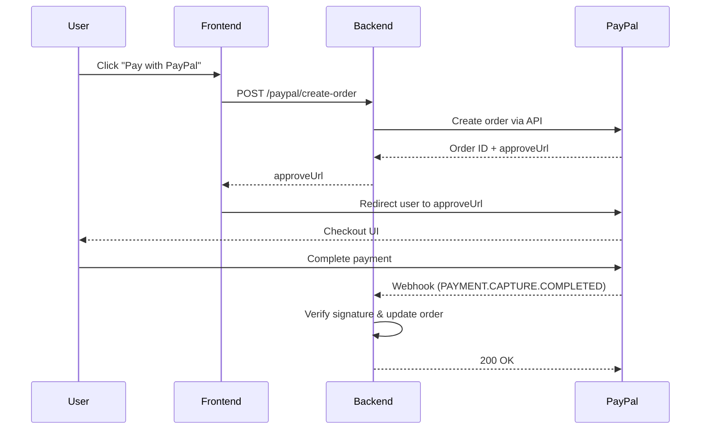

# 💰 PayPal Payment Handling Guide (Post-Webhook Processing)

## 🧭 Mục tiêu
Tài liệu này hướng dẫn quy trình **xử lý dữ liệu thanh toán sau khi webhook PayPal trả về**  
— bao gồm verify chữ ký, cập nhật đơn hàng trong DB, gửi email, và các tác vụ kinh doanh khác.

---

## ⚙️ 1️⃣ Tổng quan luồng thanh toán PayPal



---

## 🧩 2️⃣ Mục tiêu của bước "post-webhook handling"

Khi webhook PayPal được verify `SUCCESS`, hệ thống backend cần:

| Mục tiêu | Hành động |
|-----------|------------|
| Đảm bảo webhook là thật | Verify chữ ký thành công |
| Ghi nhận giao dịch | Lưu thông tin payment vào DB |
| Cập nhật trạng thái đơn hàng | Từ `PENDING` → `PAID` |
| Gửi thông báo / email | Xác nhận thanh toán cho người dùng |
| Kích hoạt quyền lợi / sản phẩm | Unlock dịch vụ, cấp token, gửi hàng |
| Ghi log sự kiện | Đảm bảo idempotency (không xử lý trùng) |

---

## 🧾 3️⃣ Cấu trúc dữ liệu trong event PayPal

Khi `event.event_type = PAYMENT.CAPTURE.COMPLETED`, bạn nhận được payload như:

```json
{
  "id": "WH-4JK59271PC8770311-9D517218GS861580D",
  "event_type": "PAYMENT.CAPTURE.COMPLETED",
  "resource": {
    "id": "3GG57250SL7328348",
    "amount": {
      "value": "29.99",
      "currency_code": "USD"
    },
    "status": "COMPLETED",
    "supplementary_data": {
      "related_ids": { "order_id": "6S5011234B5562345" }
    },
    "update_time": "2025-10-29T05:45:22Z"
  }
}
```

---

## ⚙️ 4️⃣ Xử lý webhook trong controller

```ts
if (verifyRes.data.verification_status === 'SUCCESS') {
  const eventType = event.event_type;
  const resource = event.resource;

  switch (eventType) {
    case 'PAYMENT.CAPTURE.COMPLETED':
      await this.paymentService.handleCaptureCompleted(resource);
      break;

    case 'PAYMENT.CAPTURE.DENIED':
      await this.paymentService.handleCaptureDenied(resource);
      break;

    case 'PAYMENT.CAPTURE.REFUNDED':
      await this.paymentService.handleCaptureRefunded(resource);
      break;

    default:
      console.log('Unhandled PayPal event:', eventType);
  }
}
```

---

## 🧠 5️⃣ Xây dựng `PaymentService` để xử lý nghiệp vụ

**📄 `paypal/payment.service.ts`**

```ts
import { Injectable } from '@nestjs/common';
import { PrismaService } from 'src/prisma/prisma.service';
import { MailService } from 'src/mail/mail.service';

@Injectable()
export class PaymentService {
  constructor(
    private prisma: PrismaService,
    private mailService: MailService,
  ) {}

  async handleCaptureCompleted(resource: any) {
    const orderId = resource?.supplementary_data?.related_ids?.order_id;
    const transactionId = resource?.id;
    const amount = resource?.amount?.value;
    const currency = resource?.amount?.currency_code;

    console.log('💰 Capture Completed:', { orderId, transactionId, amount });

    // ✅ 1. Đảm bảo event chưa xử lý (idempotency)
    const exists = await this.prisma.paypalEvent.findUnique({
      where: { eventId: resource.id },
    });
    if (exists) return console.log('⚠️ Duplicate event ignored');

    await this.prisma.paypalEvent.create({
      data: {
        eventId: resource.id,
        orderId,
        amount,
        currency,
        type: 'PAYMENT.CAPTURE.COMPLETED',
      },
    });

    // ✅ 2. Cập nhật trạng thái đơn hàng
    await this.prisma.order.updateMany({
      where: { paypalOrderId: orderId },
      data: { status: 'PAID', paidAt: new Date() },
    });

    // ✅ 3. Gửi email xác nhận
    await this.mailService.sendPaymentSuccessEmail(orderId, amount, currency);

    // ✅ 4. Kích hoạt quyền / sản phẩm
    // e.g. await this.subscriptionService.activatePlan(orderId);

    console.log(`✅ Order ${orderId} marked as PAID`);
  }

  async handleCaptureDenied(resource: any) {
    const orderId = resource?.supplementary_data?.related_ids?.order_id;
    await this.prisma.order.updateMany({
      where: { paypalOrderId: orderId },
      data: { status: 'FAILED' },
    });
    console.warn(`❌ Order ${orderId} failed due to denied capture.`);
  }

  async handleCaptureRefunded(resource: any) {
    const orderId = resource?.supplementary_data?.related_ids?.order_id;
    await this.prisma.order.updateMany({
      where: { paypalOrderId: orderId },
      data: { status: 'REFUNDED' },
    });
    console.log(`💸 Order ${orderId} marked as REFUNDED`);
  }
}
```

---

## 🧱 6️⃣ Thiết kế bảng log để đảm bảo idempotency

**`paypal_event` (hoặc `webhook_log`)**

| Field | Type | Description |
|--------|------|-------------|
| `id` | UUID / Auto | Primary key |
| `eventId` | String | PayPal event ID |
| `orderId` | String | Order liên quan |
| `type` | String | Event type |
| `amount` | Decimal | Số tiền |
| `currency` | String | Mã tiền tệ |
| `createdAt` | Datetime | Ngày nhận event |

---

## 🔒 7️⃣ Xử lý retry và duplicate webhook
PayPal có thể gửi **cùng một webhook nhiều lần** nếu server bạn chưa trả `200 OK`.

Do đó, cần kiểm tra:
```ts
const exists = await prisma.paypalEvent.findUnique({
  where: { eventId: resource.id },
});
if (exists) return res.status(200).send('Duplicate event ignored');
```

---

## ✉️ 8️⃣ Gửi email xác nhận (tuỳ chọn)
Ví dụ template:

```txt
Subject: Payment confirmed for Order #{{orderId}}

Hi {{userName}},

We have received your payment of {{amount}} {{currency}}.
Your order {{orderId}} is now marked as PAID.

Thank you for shopping with us!
```

---

## 🧩 9️⃣ Tổng kết pipeline xử lý

| Bước | Mô tả |
|------|--------|
| 1 | Webhook nhận được từ PayPal |
| 2 | Verify chữ ký thành công |
| 3 | Kiểm tra trùng lặp event |
| 4 | Cập nhật trạng thái đơn hàng |
| 5 | Gửi email xác nhận |
| 6 | Ghi log event vào DB |
| 7 | Trả `200 OK` cho PayPal |

---

## ✅ Kết quả mong đợi

| Event Type | Hệ thống thực hiện | Trạng thái Order |
|-------------|--------------------|------------------|
| PAYMENT.CAPTURE.COMPLETED | Cập nhật DB, gửi email, kích hoạt dịch vụ | PAID |
| PAYMENT.CAPTURE.DENIED | Ghi log, cập nhật DB | FAILED |
| PAYMENT.CAPTURE.REFUNDED | Ghi log, cập nhật DB | REFUNDED |

---

**Author:** Dev Team — *Ecom_Project / PayPal Integration*
